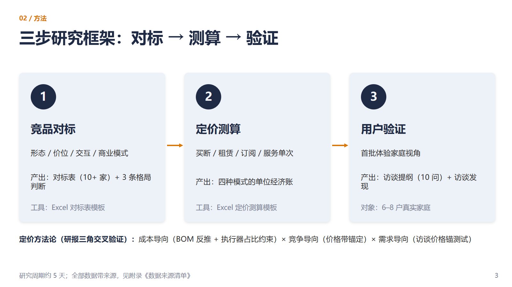
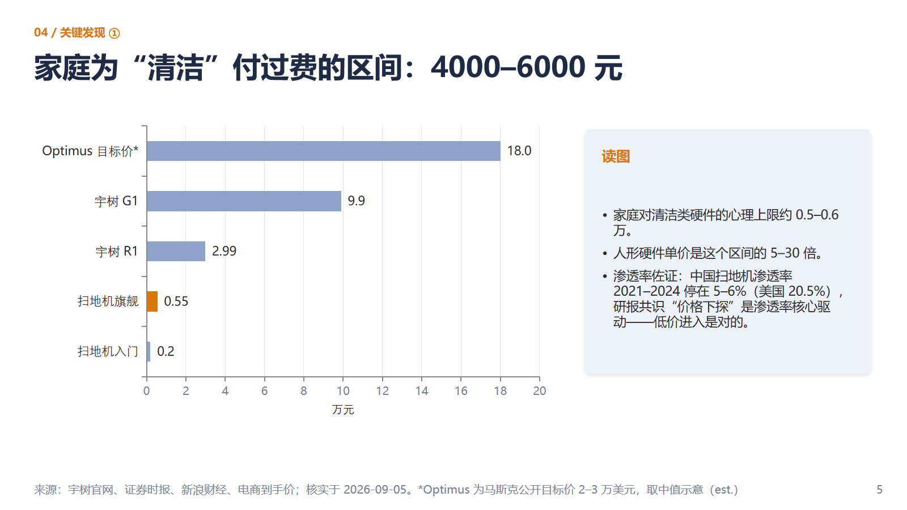
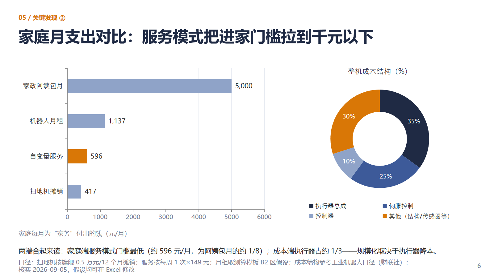
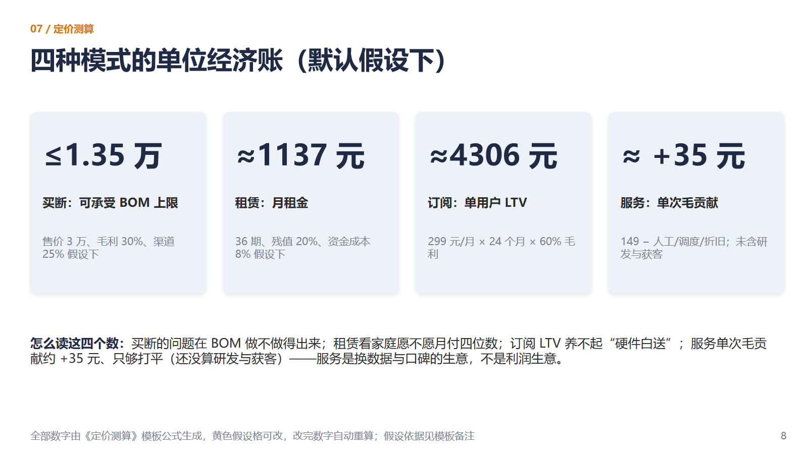

# 家庭服务机器人上市与定价模式研究

> 个人研究项目 ｜ 作者：黄川（香港城市大学 数学与统计硕士，2027 届）｜ 数据核实截至 2026-09-05

一个为回答真实 GTM 问题而做的完整研究：**家庭服务机器人该怎么定价？首批家庭愿意为什么付钱？** 全部数据来自本人逐条核实的公开来源（每条带来源与核实日期），方法论参考开源市场研究框架（五步工作流 + 十项事实核查质检）。

## 核心发现（30 秒版）

1. **家庭付费只被"清洁"场景验证过**：扫地机主力价格带 4000–6000 元，中国渗透率 2021–2024 停滞在 5–6%（美国 20.5%）——价格与体验是瓶颈，支持新品类以低门槛进家。
2. **人形玩家的首批付费场景全在 B 端**：智元全系开售 9.8 万–45 万元（展演/接待）、银河通用深耕药房/无人零售（年销约 150 台）；自变量机器人以"机器人+阿姨"149 元/次的上门服务成为唯一进入家庭的玩家。
3. **四模式单位经济账**：3 万元买断的可承受 BOM 上限仅约 1.35 万元（执行器总成约占整机成本 35%）；月租约 1137 元；订阅 LTV 约 4306 元养不起"硬件白送"；服务单次毛贡献约 +35 元、仅够打平——**服务是换数据与口碑的生意，不是利润生意**。
4. **定价建议**：首批家庭低价/免费 + 每周回访换数据；规模化后"硬件贴近成本 + 能力订阅"（FSD 2026 年 2 月全球取消 6.4 万元买断、转向订阅，是方向信号）。

## 产出物

| 文件 | 说明 |
|---|---|
| [家庭服务机器人上市与定价模式研究报告.pdf](家庭服务机器人上市与定价模式研究报告.pdf) | 8 页研报：执行摘要、方法与局限、市场与渗透率、竞争格局、定价分析、用户验证设计、附录（数据锚点 + 十项质检清单） |
| [上市与定价研究_11页.pptx](上市与定价研究_11页.pptx) | 11 页汇报版：竞品格局、价格天花板、月支出对比、成本结构、四模式测算、定价建议 |
| [家庭服务机器人_竞品对标与定价测算模板.xlsx](家庭服务机器人_竞品对标与定价测算模板.xlsx) | 4 个 sheet：10 家竞品对标表、定价测算（黄色假设格可改、公式自动重算、含敏感性矩阵与 TAM 速算）、数据来源清单、调研录入与自动出图 |
| [docs/00_研究操作手册.md](docs/00_研究操作手册.md) | 5 天研究流程：对标方法、测算推导、访谈提纲（10 问 × 4 模块）、面试话术 |
| [docs/03_用户调研问卷.md](docs/03_用户调研问卷.md) | 12 题调研问卷（居住类型 × 年龄段 × 价格锚三档），用于验证付费意愿假设 |

## 部分页面预览

| 研究框架 | 价格天花板 |
|---|---|
|  |  |
| **月支出对比 + 成本结构** | **定价建议** |
|  |  |

## 方法与诚信声明

- **数据来源分级**：公司官网/官方商城 > 主流财经媒体（财联社、证券时报、人民网、新浪财经等）> 电商到手价 > 社区讨论（仅定性参考）；关键数字 ≥2 个独立来源交叉验证，全部标注核实日期。
- **测算透明**：所有模型数字由 Excel 公式生成，假设显式披露、可修改、可挑战——"假设可以聊，公式是对的"。
- **用户侧结论标注状态**：访谈提纲与问卷为已完成的设计，付费意愿结论以问卷 ≥30 份 / 访谈 ≥3 户回收后为准，未回收前不声称"已完成调研"。
- **AI 使用披露**：AI 仅用于结构化整理与成文，未引入未经核实的数据。
- 项目边界：个人研究、非任何公司委托；不构成投资建议。

## 与 GTM 岗位的对应

| 本研究产出 | 对应 GTM 职责 |
|---|---|
| 竞品对标表 + 格局判断 | 市场洞察与竞品分析报告 |
| 四模式定价测算 + 建议 | 定价策略调研 |
| 访谈提纲 + 调研问卷（执行中） | 用户调研与需求分析 |
| 研报 + 汇报 PPT + 可复算模型 | 汇报材料与上市效果评估基础 |
